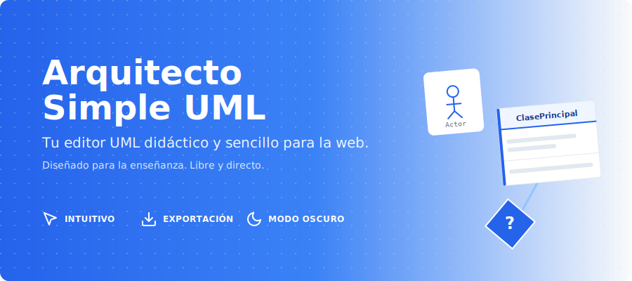
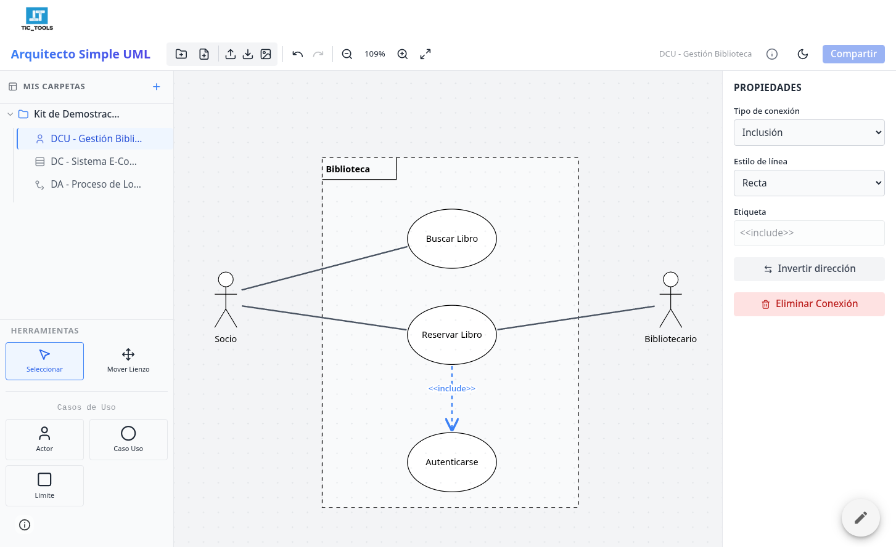
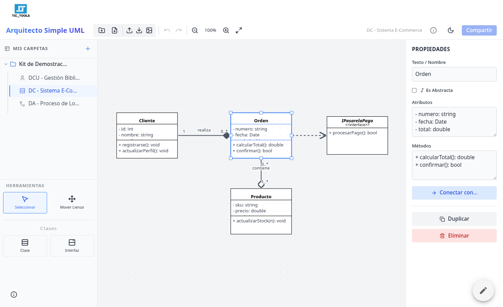
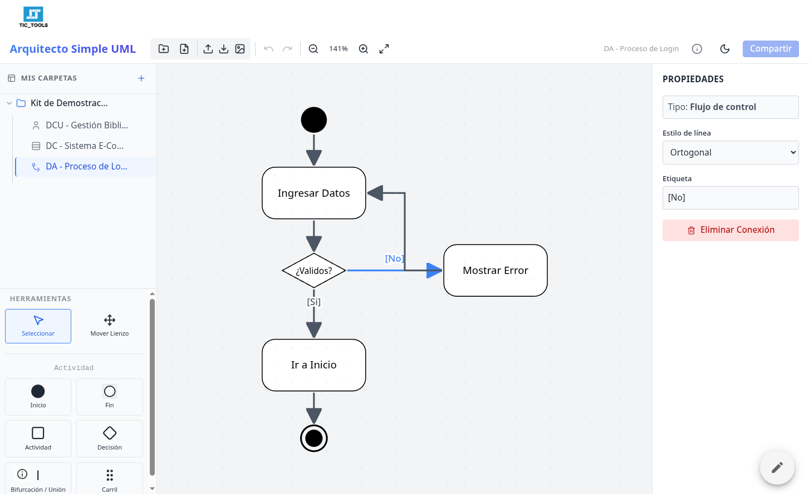

# Arquitecto Simple UML

**Arquitecto Simple UML (AS-UML)** es un editor de UML ligero, experimental y diseñado con fines didácticos para crear diagramas de manera sencilla. Es una Single Page Application (SPA) contenida en un único archivo HTML, lo que facilita su distribución y uso sin instalaciones complejas.

## Demo Online

Puedes utilizar el editor sin limitaciones y directamente en tu navegador accediendo a:

👉 **[https://sites.google.com/view/umlsimple](https://sites.google.com/view/umlsimple)**

## Características Principales

*   **Tipos de Diagramas Soportados:**
    *   **DCU:** Diagramas de Casos de Uso (Actores, Casos de uso, Límites).
        
        
    *   **DC:** Diagramas de Clases (Clases, Interfaces, Relaciones).
        
        
    *   **DA:** Diagramas de Actividad (Inicio, Fin, Actividades, Decisiones, Carriles).
        
        
*   **Gestión de Proyectos:** Organización mediante carpetas y múltiples diagramas.
*   **Persistencia Local:** Guardado automático en el navegador (`localStorage`).
*   **Importar/Exportar:** Copias de seguridad completas en formato JSON y exportación de diagramas a imágenes PNG.
*   **Interfaz Moderna:** Diseño limpio con soporte para **Modo Oscuro**, zoom, guías de alineación inteligentes y atajos de teclado.

## Tecnologías Utilizadas

Esta herramienta funciona directamente en el navegador sin backend ("serverless") gracias a:
*   **React 18:** Cargado vía CDN.
*   **Tailwind CSS:** Para el estilizado de la interfaz.
*   **Babel Standalone:** Transpilación de JSX/TypeScript en tiempo de ejecución.
*   **Lucide React:** Iconografía moderna.

## Uso

Simplemente abre el archivo `index.html` en cualquier navegador web moderno. Aunque no se requiere instalar dependencias locales (Node.js, npm, etc.), **se necesita conexión a internet** para descargar las librerías y estilos a través de CDN.

## Autor

Desarrollado por [Pablo Felip Monferrer](https://www.linkedin.com/in/pfelipm) como herramienta de apoyo para la asignatura de Ingeniería del Software.

## Licencia

Este proyecto se distribuye bajo los términos del archivo [LICENSE](LICENSE).
